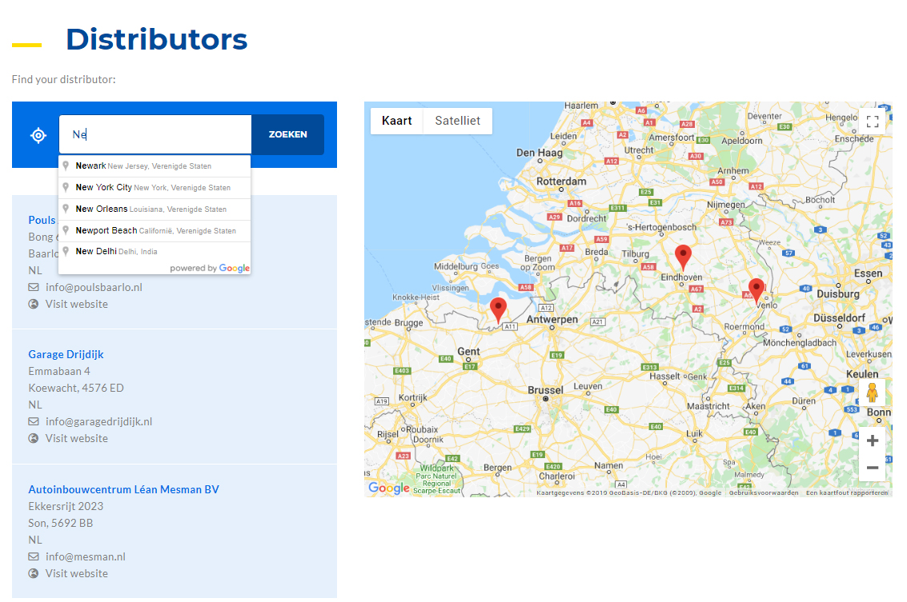

# Distributors
Show distributors over google map.
This is an example on how you can show your distributors over the google map within a proximity range. Based on number of distributors, google map zoom level will auto adjusted.

Installation:
1. Place the module into /modules folder
2. This module require contributed GeoLocation and Address module
3. Install the module, it will install a content type "Distributor" and a views block "Distributors"
4. The will create an Url /distributors for distributor search
5. Before search there is a settings under Config->User Interface->Distributors Settings (/admin/config/user-interface/distributors ). You need to set the API Key and Others before testing.
6. Need to download this library https://github.com/googlemaps/v3-utility-library and extract and put into libraries folder so location of the markerclusterer.js will be /libraries/v3-utility-library/markerclusterer/src/markerclusterer.js

Note: 
- Please set GeoLocation module settings and Distributor module settings.
- Address module need to install through composer.

---------------------------------------------------------------
You can contact me at: <strong>Shafiq Hossain</strong>, <em>md.shafiq.hossain@gmail.com</em>